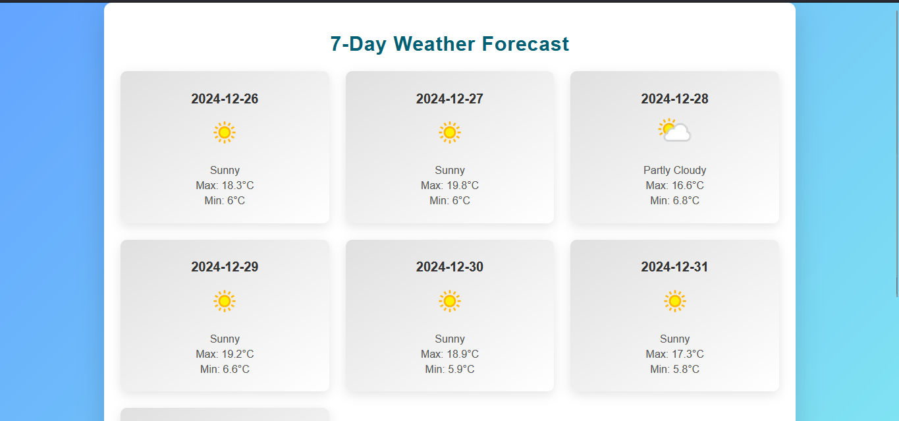

## Weather Check

**Weather Check** is a simple web application that allows users to view a 7-day weather forecast for any city around the world. The app fetches real-time weather data through an API and displays it in a clean and user-friendly interface.
## Features

- Displays the 7-day weather forecast.
- Shows temperature, weather conditions, and icons representing the weather for each day.
- A responsive layout that looks great on mobile and desktop devices.

## Technologies Used

- **HTML**: For structure and content of the page.
- **CSS**: For styling and layout.
- **JavaScript**: For fetching and displaying weather data.
- **OpenWeather API**: To get the weather data.

## How to Use

1. Clone the repository to your local machine using the following command:

   ```bash
   git clone https://github.com/proobker/Weather_Check.git
   ```

2. Navigate to the project folder:

   ```bash
   cd Weather_Check
   ```

3. Open the `index.html` file in your browser to view the weather forecast.

## API Key Setup

To get the weather data, this application uses the **OpenWeather API**. Follow the steps below to obtain your own API key:

### Steps to Get an API Key:

1. Go to the [OpenWeather API website](https://openweathermap.org/api).

2. Create an account or log in if you already have one.

3. After logging in, navigate to the **API Keys** section under your account settings.

4. Click on **Create New Key** and give it a name (e.g., "Weather Check App").

5. Copy the generated API key.

6. In your project, locate the `script.js` file and replace the placeholder API key with your own in the following line:

   ```javascript
   const API_KEY = 'Your_API'; // Replace with your WeatherAPI key
   ```
  ```python
  def fetch_weather(location):
    API_KEY = "Your_API"  # Replace with your WeatherAPI key
    BASE_URL = "https://api.weatherapi.com/v1/current.json"
  ```
7. Save the changes, and you're ready to fetch weather data.

### Example API Request

The application makes a request to the OpenWeather API with the following URL format:

```text
https://api.openweathermap.org/data/2.5/onecall?lat={latitude}&lon={longitude}&exclude=hourly,minutely&units=metric&appid={API_KEY}
```

- Replace `{latitude}` and `{longitude}` with the coordinates of the city you want to fetch weather data for.
- Replace `{API_KEY}` with your API key.

## Example Screenshot



## Contribution

Contributions are welcome! Follow these steps to contribute:

1. Fork this repository.
2. Create a new branch:
   ```bash
   git checkout -b feature-name
   ```
3. Commit your changes:
   ```bash
   git commit -m "Add feature description"
   ```
4. Push to the branch:
   ```bash
   git push origin feature-name
   ```
5. Create a pull request.

---

## License

This project is licensed under the [MIT License](LICENSE).

---

## Contact

For queries or feedback, contact:
- **Email**: rrabi.dahal@gmail.com
- **GitHub**: [proobker](https://github.com/proobker)

---
